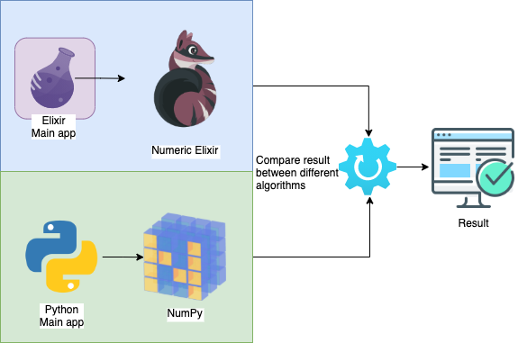

# Neural networks in Elixir and Python

A three-repository home for Lucas Campos Tavano's Computer Engineering capstone project at the Federal University of Technology – Paraná (UTFPR). The original work explored image classification with Elixir/Nx and Python/TensorFlow. This repository is the overview; the runnable implementations live in separate repositories.

| Repository | Role | Current scope |
| --- | --- | --- |
| [Elixir neural network experiments](https://github.com/sallaumen/elixir_neural_network_labs) | Nx, Axon, EXLA, and Scidata implementation | MNIST and CIFAR-10 full train/test runs verified on the current stack; historical manual Nx code |
| [Python neural network experiments](https://github.com/sallaumen/python_neural_network_labs) | TensorFlow/Keras implementation | MNIST and CIFAR-10 full train/test runs verified on the current stack |
| This repository | Project overview and comparison guidance | Context, diagram, and [methodology](docs/methodology.md) |

## Start here

1. Choose a dataset and implementation from the table above.
2. Follow that repository's README for its toolchain and commands.
3. Read the [comparison methodology](docs/methodology.md) before interpreting or publishing performance numbers.

The historical implementations are useful demonstrations, but they are **not yet a controlled language benchmark**. Model architectures, optimizers, batch sizes, and backend configurations differ. The checked-in images document the original project and are not new measurements. The Elixir repository [records the original OTP 24 / Elixir 1.13 toolchain](https://github.com/sallaumen/elixir_neural_network_labs/blob/main/docs/historical-environment.md) separately from its current stack.

The [7 October 2026 validation record](docs/validation-2026-10-07.md) documents full dataset runs on both current implementations. Those single runs verify that training and held-out evaluation work; they do not support a speed comparison.

## Project direction

The maintained implementations now have held-out evaluation paths. The next stage is to define equivalent model specifications, capture full environment details, and run repeated measurements on the same hardware. The [methodology](docs/methodology.md) lists the minimum evidence needed for a defensible comparison.

## Author

Lucas Campos Tavano · Computer Engineering, UTFPR
